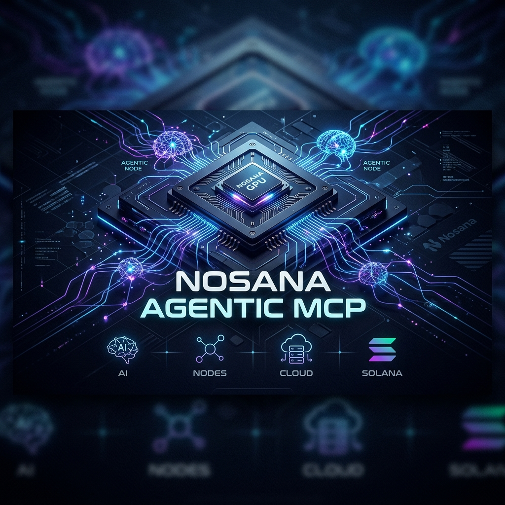

# 🚀 Nosana Agentic MCP


> [!NOTE]
> **MVP Status**: This is an early MVP showcasing the core functionality of the Nosana Agentic MCP. More features, optimizations, and tools are on the way!



> **85% cheaper than AWS. As easy as Vercel. The human-centered bridge to decentralized GPU power.**

Nosana Agentic MCP is a comprehensive **Model Context Protocol (MCP)** server that transforms complex GPU infrastructure into a simple, conversational experience. Built for developers, researchers, and indie hackers, it allows AI agents (like Claude or ChatGPT) to manage the entire lifecycle of GPU-accelerated deployments on the [Nosana Network](https://nosana.io) using everyday language.

---

## 🌟 The Vision: Making GPU Compute Accessible

Modern GPU infrastructure is powerful but often requires a "DevOps certification" just to host a simple model. Our mission is to hide that complexity.

### 5 Core Use Cases
*   ⚡ **Instant Model Hosting**: Automatically detect frameworks (PyTorch/TF), estimate VRAM, and deploy a production API in seconds.
*   🏋️ **On-Demand Training**: Intelligent data pipelines that zip, upload to IPFS, and monitor training jobs on high-end GPUs.
*   🤖 **24/7 Agent Hosting**: Persistent, low-cost environments optimized for ElizaOS trading bots and social agents.
*   💰 **Live Cost Checker**: Real-time market analysis to find the cheapest RTX 4090 or A5000 instances instantly.
*   📦 **Batch Data Processing**: High-speed parallelization for video transcoding and mass file processing.

---

## 🛠️ Current Capabilities

The Nosana MCP server provides a robust toolkit for complete lifecycle management:

### 1. Guided Deployment (The "Smart" Path)
*   **`get_deployment_options`**: The mandatory entry gate. Analyzes your project and presents GPU Tiers (Cheapest, Balanced, Performance) and duration options.
*   **`smart_deploy`**: The "all-in-one" orchestrator. Handles packaging → IPFS → Market Selection → Submission → Health Checking with 3x retry reliability.

### 2. Model & Project Analysis
*   **`analyze_model`**: Scans directories to detect ML frameworks and recommend VRAM.
*   **`compose_job_definition`**: Auto-generates JobDefinitions for **Streamlit, FastAPI, Flask, Jupyter, Ollama, and ComfyUI**.

### 3. Lifecycle Management
*   **Scale & Update**: `update_replicas`, `update_timeout`, and `create_revision` for seamless scaling.
*   **Control**: `list_deployments`, `stop_deployment`, and `restart_deployment` for full operational control.

### 4. Monitoring & Insights
*   **`get_job_logs`**: Advanced log retrieval with text search, operation filtering, and tail limits.
*   **`get_deployment_events`**: Full history of state changes (Queued → Starting → Running).
*   **`get_deployment_status`**: Real-time readiness checks with automated HTTP health pings.

### 5. Market Discovery
*   **`get_gpu_options`**: Live marketplace pricing for RTX 4090s, 3070s, and more.
*   **`check_market_queue`**: Real-time congestion monitoring to ensure instant deployment.

---

## 🚀 Reliability Hardening

Built to handle the realities of decentralized networks:
- **Triple Gateway Fallback**: Automatically rotates between Nosana, Cloudflare, and IPFS.io if a gateway is slow or down.
- **Intelligent Retries**: 10-second wait intervals between container download attempts.
- **Strict Diagnostics**: Immediate reporting of failure reasons—no more "silent failures."

---

## 💻 Technical Setup

### Prerequisites
- [Node.js](https://nodejs.org/) (v18+)
- [Solana Wallet](https://phantom.app/) with some $NOS or $SOL for deployment.

### Installation
1. Clone the repository:
   ```bash
   git clone https://github.com/naveendhaterwal/Nosana-Agentic-Mcp.git
   cd Nosana-Agentic-Mcp
   npm install
   ```

2. Configure environment:
   ```bash
   cp .env.example .env
   # Add your SOLANA_PRIVATE_KEY and other settings
   ```

3. Build:
   ```bash
   npm run build
   ```

### Integration with Claude Desktop
Add this to your `claude_desktop_config.json`:

```json
{
  "mcpServers": {
    "nosana-agentic": {
      "command": "node",
      "args": ["/path/to/Nosana-Agentic-Mcp/dist/index.js"],
      "env": {
        "SOLANA_PRIVATE_KEY": "your_private_key_here",
        "NOSANA_ENV": "mainnet"
      }
    }
  }
}
```

---

## 👨‍💻 Author
**Naveen Kumar** - Freelance Full-Stack & ML Developer
> "Building the bridges I wish I had when I was frustrated by AWS bills."

---

## 📜 License
This project is licensed under the **ISC License**.
